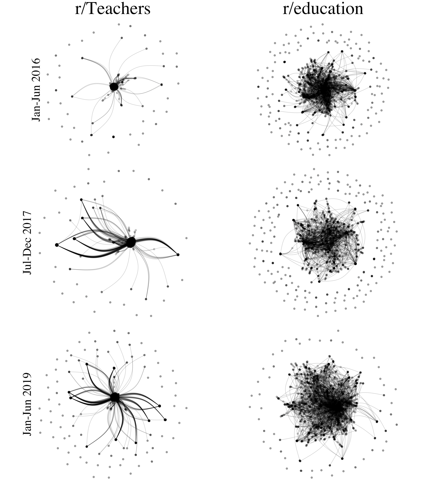

```{r setup, include=FALSE}
usethis::use_git_ignore(c("*.csv", "*.rds"))
options(htmltools.dir.version = FALSE)

library(knitr)
library(tidyverse)
library(xaringan)
library(fontawesome)
library(igraph)
library(tidygraph)
library(ggraph)
library(ggthemes)
library(cowplot)
library(kableExtra)
```

class: inverse, center, middle

# `r fa("far fa-images", fill = "#fff")`

**View the slides:** 

[bretsw.github.io/eme6356-ss22-module5](https://bretsw.github.io/eme6356-ss22-module5)

---

# Data Stories

```{r, out.width = "420px", echo = FALSE, fig.align = "center"}
include_graphics("img/5-data-story1.png")
```

>**"If it's free, you're the product."**

(Tweet from [@EthicsInBricks](https://twitter.com/EthicsInBricks/status/1375711433862877187))

---

# Data Stories

```{r, out.width = "420px", echo = FALSE, fig.align = "center"}

```

>"Dashboards...alert you to something you should pay attention to. But most of the time they don’t tell you what’s actually happening and they certainly don’t tell you why something is happening."
>
>[@ry_estrellado on locking in the use of data dashboards](https://ryanestrellado.com/how-to-measure-what-matters)

(Tweet from [@john_reyes](https://twitter.com/john_reyes/status/1442854996328976392))

---

class: inverse, center, middle

# `r fa("thumbs-up", fill = "#fff")` <br> <br> Module 4 Discussion <br> Themes and Kudos

---

class: inverse, center, middle

# `r fa("far fa-question-circle", fill = "#fff")` <br> <br> Module 4 Discussion <br> Final Thoughts?

---

class: inverse, center, middle

# `r fa("fas fa-chart-line", fill = "#fff")` <br> <br> Module 5: <br> Data Visualization

---

class: inverse, center, middle

# `r fa("fas fa-chart-line", fill = "#fff")` <br> <br> **Defining Analytics**

**Measure `r fa("fas fa-arrow-right", fill = "#fff")` Collect `r fa("fas fa-arrow-right", fill = "#fff")` Analyze `r fa("fas fa-arrow-right", fill = "#fff")` Report**

---

# Data Visualization

```{r, out.width = "600px", echo = FALSE, fig.align = "center"}

```

Measure `r fa("fas fa-arrow-right", fill = "#782F40")` Collect `r fa("fas fa-arrow-right", fill = "#782F40")` Analyze `r fa("fas fa-arrow-right", fill = "#782F40")` Report

--

### `r fa("far fa-question-circle", fill = "#782F40")` **What might we measure? How might we report?**

---

class: inverse, center, middle

# `r fa("fas fa-dice-one", fill = "#fff")` `r fa("fas fa-dice-two", fill = "#fff")` `r fa("fas fa-dice-three", fill = "#fff")` `r fa("fas fa-dice-four", fill = "#fff")` `r fa("fas fa-dice-five", fill = "#fff")` <br> <br> **Data Visualization** <br><br> Examples

---

class: inverse, center, middle

# `r fa("fas fa-dice-one", fill = "#fff")` <br><br> Measure \#1 <br><br> `r fa("fas fa-birthday-cake", fill = "#fff")` Just for Fun

---

# `r fa("fas fa-dice-one", fill = "#fff")` Just for Fun

```{r, out.width = "100%", echo = FALSE, fig.align = "center"}

```

---

# `r fa("fas fa-dice-one", fill = "#fff")` Just for Fun

```{r, out.width = "720px", echo = FALSE, fig.align = "center"}
include_graphics("img/5-ex1-2.png")
```

---

class: inverse, center, middle

# `r fa("fas fa-dice-two", fill = "#fff")` <br><br> Measure \#2 <br><br> `r fa("fab fa-uncharted", fill = "#fff")` Uncertainty

---

# `r fa("fas fa-dice-two", fill = "#fff")` Uncertainty

```{r, out.width = "100%", echo = FALSE, fig.align = "center"}
include_graphics("img/5-ex2-1.png")
```

---

# `r fa("fas fa-dice-two", fill = "#fff")` Uncertainty

```{r, out.width = "100%", echo = FALSE, fig.align = "center"}
include_graphics("img/5-ex2-2.png")
```

---

# `r fa("fas fa-dice-two", fill = "#fff")` Uncertainty

```{r, out.width = "100%", echo = FALSE, fig.align = "center"}
include_graphics("img/5-ex2-3.png")
```

---

# `r fa("fas fa-dice-two", fill = "#fff")` Uncertainty

```{r, out.width = "100%", echo = FALSE, fig.align = "center"}
include_graphics("img/5-ex2-4.png")
```

---

class: inverse, center, middle

# `r fa("fas fa-dice-three", fill = "#fff")` <br><br> Measure \#3 <br><br> `r fa("fas fa-hourglass-half", fill = "#fff")` Time

---

# `r fa("fas fa-dice-three", fill = "#fff")` Time

```{r, out.width = "720px", echo = FALSE, fig.align = "center"}
include_graphics("img/5-ex3-1.png")
```

---

# `r fa("fas fa-dice-three", fill = "#fff")` Time

```{r, out.width = "100%", echo = FALSE, fig.align = "center"}
include_graphics("img/5-ex3-2.png")
```

---

# `r fa("fas fa-dice-three", fill = "#fff")` Time

```{r, out.width = "100%", echo = FALSE, fig.align = "center"}
include_graphics("img/5-ex3-3.png")
```

---

# `r fa("fas fa-dice-three", fill = "#fff")` Time

```{r, out.width = "100%", echo = FALSE, fig.align = "center"}
include_graphics("img/5-ex3-4.png")
```

---

# `r fa("fas fa-dice-three", fill = "#fff")` Time

```{r, out.width = "520px", echo = FALSE, fig.align = "center"}
include_graphics("img/5-ex3-5.png")
```

---

class: inverse, center, middle

# `r fa("fas fa-dice-four", fill = "#fff")` <br><br> Measure \#4 <br><br> `r fa("fas fa-share-alt", fill = "#fff")` Networks

---

# `r fa("fas fa-dice-four", fill = "#fff")` Networks

```{r, out.width = "100%", echo = FALSE, fig.align = "center"}

```

---

# `r fa("fas fa-dice-four", fill = "#fff")` Networks

```{r, out.width = "100%", echo = FALSE, fig.align = "center"}
include_graphics("img/5-ex4-2.png")
```

---

# `r fa("fas fa-dice-four", fill = "#fff")` Networks

```{r, out.width = "480px", echo = FALSE, fig.align = "center"}
include_graphics("img/5-ex4-3.png")
```

---

# `r fa("fas fa-dice-four", fill = "#fff")` Networks

```{r, out.width = "480px", echo = FALSE, fig.align = "center"}

```

---

class: inverse, center, middle

# `r fa("fas fa-dice-five", fill = "#fff")` <br><br> Measure \#5 <br><br> `r fa("fas fa-comments", fill = "#fff")` Topics

---

# `r fa("fas fa-dice-five", fill = "#fff")` Topics

```{r, out.width = "480px", echo = FALSE, fig.align = "center"}
include_graphics("img/5-ex5-1.png")
```

---

# `r fa("fas fa-dice-five", fill = "#fff")` Topics

```{r, out.width = "480px", echo = FALSE, fig.align = "center"}
include_graphics("img/5-ex5-2.png")
```

---

# `r fa("fas fa-dice-five", fill = "#fff")` Topics

```{r, out.width = "360px", echo = FALSE, fig.align = "center"}

```

---

# `r fa("fas fa-dice-five", fill = "#fff")` Topics

```{r, out.width = "100%", echo = FALSE, fig.align = "center"}
include_graphics("img/5-ex5-4.png")
```

---

# `r fa("fas fa-dice-five", fill = "#fff")` Topics

```{r, out.width = "100%", echo = FALSE, fig.align = "center"}

```

---

# `r fa("fas fa-dice-five", fill = "#fff")` Topics

```{r, out.width = "100%", echo = FALSE, fig.align = "center"}

```

---

class: inverse, center, middle

# Collection of Data Visualization Tools

<div class="padlet-embed" style="border:1px solid rgba(0,0,0,0.1);border-radius:2px;box-sizing:border-box;overflow:hidden;position:relative;width:100%;background:#F4F4F4"><p style="padding:0;margin:0"><iframe src="https://fsu.padlet.org/embed/xxl6opndte57rmc5" frameborder="0" allow="camera;microphone;geolocation" style="width:100%;height:420px;display:block;padding:0;margin:0"></iframe></p><div style="padding:8px;text-align:right;margin:0;"><a href="https://padlet.com?ref=embed" style="padding:0;margin:0;border:none;display:block;line-height:1;height:16px" target="_blank"></a></div></div>

---

class: inverse, center, middle

# `r fa("far fa-question-circle", fill = "#fff")` <br> <br> What might we measure? <br> <br> How might we report?

---

class: inverse, center, middle

# `r fa("fas fa-binoculars", fill = "#fff")` <br><br> Looking Ahead

---

# Semester schedule

```{r, out.width = "100%", echo = FALSE, fig.align = "center"}
include_graphics("img/across-time.jpg")
```

- **Module 5:** Data Visualization
- **Module 6:** Ethics in Analytics
- **Module 7:** Future of Analytics
- **Module 8:** Case Discussions

---

# Major Assignments

```{r, out.width = "480px", echo = FALSE, fig.align = "center"}
include_graphics("img/build.jpg")
```

### Analytics Assignments

--

- Analytics Practice (200 points) - **due end of Module 5**

--

- Analytics Case Presentation (200 points; group project)

--

- Analytics Ethics Statement (100 points)

---

class: inverse, center, middle

# `r fa("far fa-question-circle", fill = "#fff")` <br><br> Questions

<hr>

**What questions can I answer for you now?**

**How can I support you this week?**

<hr>

`r fa("envelope", fill = "#fff")` [bret.staudtwillet@fsu.edu](mailto:bret.staudtwillet@fsu.edu) | `r fa("twitter", fill = "#fff")` [@bretsw](https://twitter.com/bretsw) | `r fa("globe", fill = "#fff")` [bretsw.com](http://bretsw.com) | `r fa("fab fa-github", fill = "#fff")` [GitHub](https://github.com/bretsw/)